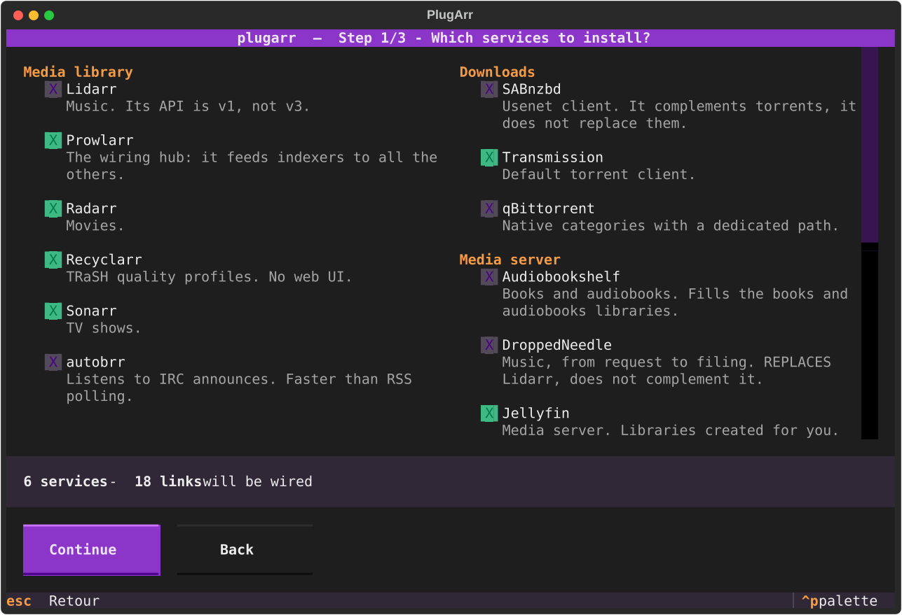
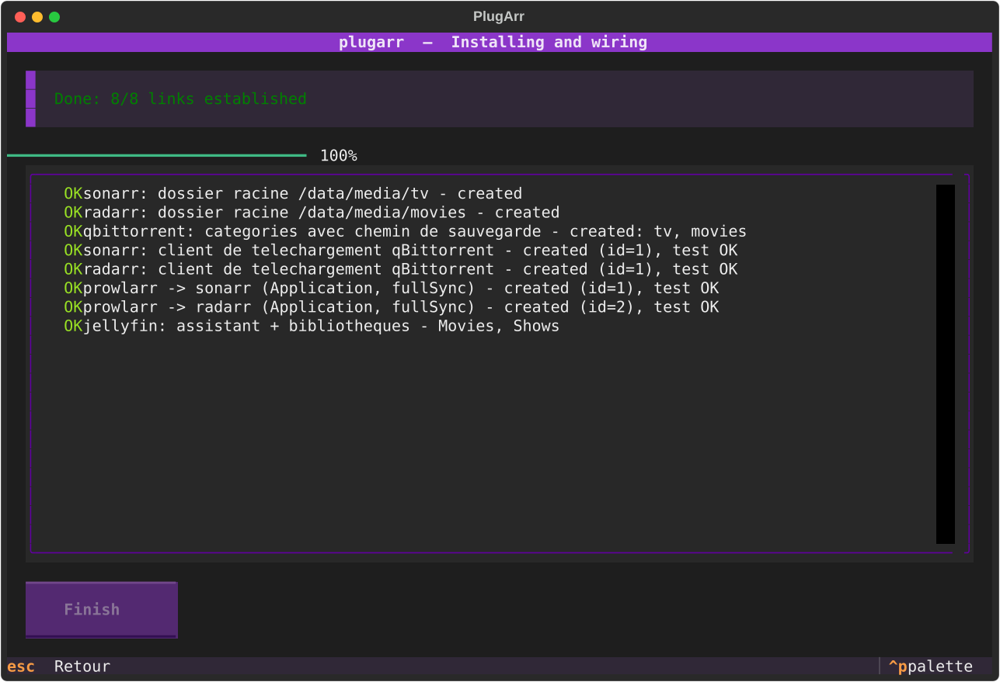
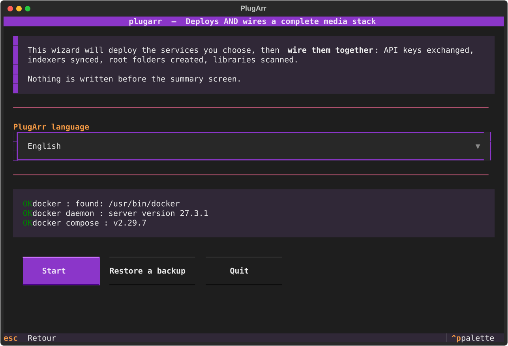
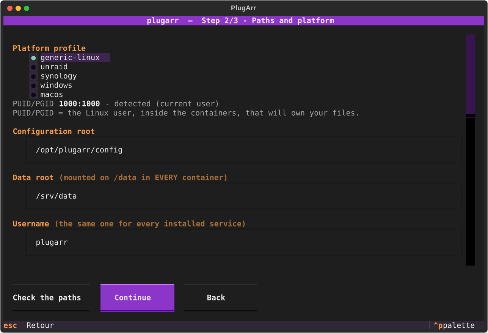
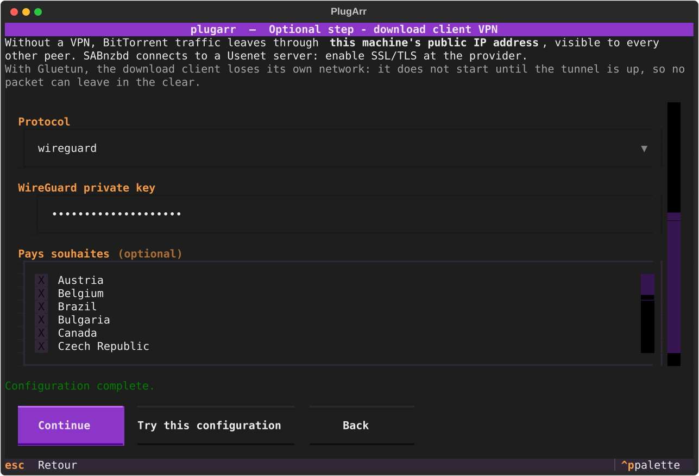
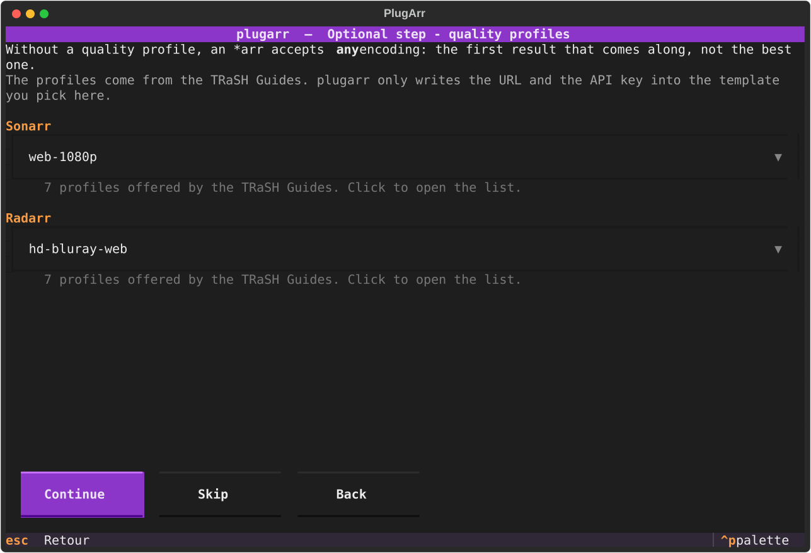
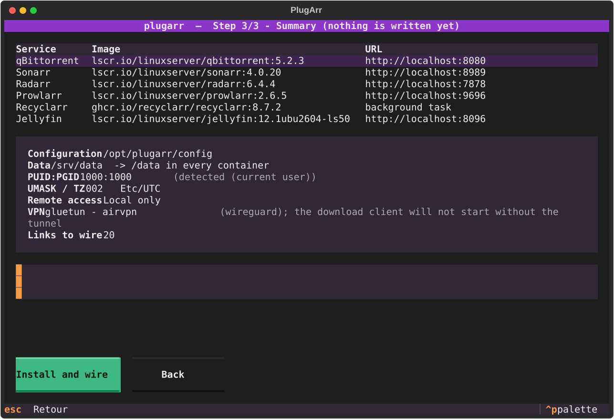
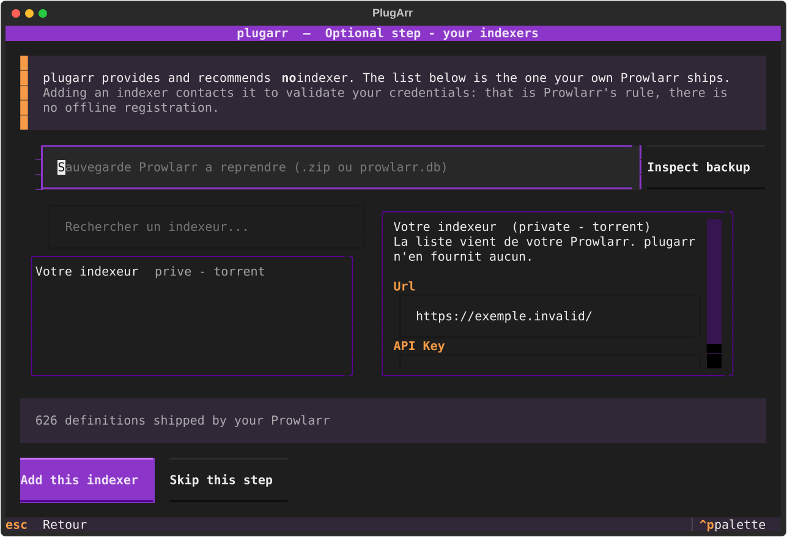
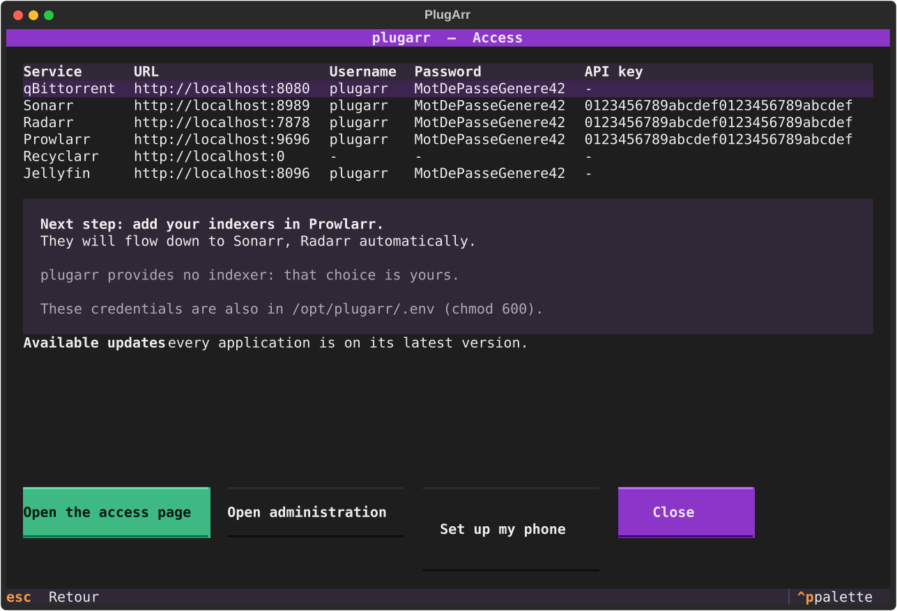

*[Français](README.md) · **English***

# PlugArr

**Deploys *and wires* a complete media stack. One command, zero clicks across eight web UIs.**

```bash
plugarr
```

**[plugarr-site.vercel.app](https://plugarr-site.vercel.app/en)** — the project site.

*In English or French, down to the error messages. PlugArr follows your system
language; your services have their own, chosen separately.*

<p align="center">
  
  
</p>

You tick what you want. By the end, Prowlarr is already pushing its indexers to Sonarr,
Radarr and Lidarr, all three know how to talk to your download client, their root folders
exist, and Jellyfin has its libraries and refreshes itself after every import.

No wizard? The same thing in one line, for a script or a CI job:

```bash
plugarr install --yes --data-root /srv/data --config-root /opt/plugarr/config
```

---

## The problem

Standing up six containers with a `docker-compose.yml` is something everyone can do.
Dozens of repositories do it very well.

What takes three hours is **what comes after**: opening every UI, copying an API key,
pasting it into another one, starting over, getting a port wrong, and finding out three
days later that imports are copying 40 GB instead of making a link.

PlugArr automates that part.

| | Deployment | Cross-app wiring | Quality profiles | Tool's language |
|---|---|---|---|---|
| DockSTARTer | yes | no | no | English |
| Saltbox | yes | partial | no | English |
| Recyclarr / Configarr | no | no | yes | English |
| **PlugArr** | **yes** | **yes** | **yes** (via Recyclarr) | **French and English** |

That last column is checked, not assumed: none of the three carries a `.po`
file, an `i18n` directory, or a single occurrence of `gettext`. Recorded on
5 September 2026, method in [docs/PRIOR-ART.en.md](docs/PRIOR-ART.en.md).

---

## What gets wired automatically

| Source | Target | What is set up |
|---|---|---|
| Prowlarr | Sonarr, Radarr, Lidarr | registered as an *Application*, indexer `fullSync` |
| autobrr | Sonarr, Radarr, Lidarr, download client | declared in autobrr, connections tested |
| Prowlarr | download client | attachment + category |
| Sonarr, Radarr, Lidarr | download client | attachment + routing by category or directory |
| Sonarr, Radarr, Lidarr | filesystem | root folder under `/data/media` |
| qBittorrent | itself | categories created with their save path |
| Sonarr, Radarr | Jellyfin | refresh notification after import |
| Jellyfin | filesystem | startup wizard + Movies, Shows and Music libraries |
| Silo | filesystem | account, **profile**, Movies, Shows and Music libraries in **read-only**, scan started |
| Sonarr, Radarr, Lidarr, Prowlarr, Jellyfin, Silo | themselves | their own UI language, chosen once |
| Sonarr, Radarr, Lidarr, Prowlarr | web UI | account created, **login actually tested** |
| Recyclarr | Sonarr, Radarr | TRaSH Guides quality profiles and custom formats, URL and key written into the official template, **first sync started** |
| qui | qBittorrent | account created, instance declared, connection confirmed by qui |
| Flood | qBittorrent | URL and credentials passed at startup |

Both download clients can coexist: every *arr is attached to both, and routing adapts on
its own. qBittorrent has native categories, Transmission does not.

Every link is **read back from the target API** after creation. The final report does not
say "I sent a POST", it says "the link exists".

---

## The trap everyone falls into: a single `/data` mount

This is mistake number one in media stacks. Mounting `/downloads` and `/media` separately
gives you two filesystems *as seen from inside the container*. Hardlinks become
impossible, and every import **copies** the file instead of linking it.

PlugArr enforces a single mount in every container:

```
${DATA_ROOT}/                    ->  /data   (in EVERY container)
├── torrents/
│   ├── movies/
│   ├── tv/
│   ├── music/
│   └── .incomplete/
└── media/
    ├── movies/                  <- Radarr root folder + Jellyfin library
    ├── tv/                      <- Sonarr root folder + Jellyfin library
    └── music/                   <- Lidarr root folder + Jellyfin library
```

The preflight does not merely hope for it: it **creates a real hardlink** between
`torrents/` and `media/` and tells you whether it worked.

---

## Two languages, not one

PlugArr exists in **French and English**, and the two settings must not be
confused:

| | Where | What it changes |
|---|---|---|
| **PlugArr's language** | welcome screen, or `--lang fr\|en` | the wizard, the command line, the report, the access page |
| **The services' language** | paths screen, or `--langue <code>` | what Sonarr, Radarr, Prowlarr, Jellyfin and Silo will show in **their** interface |

With nothing set, PlugArr follows the system language, and the services follow
PlugArr. Nothing forces you to keep them together: you may want the tool in
English and your media library in French.

The choice is kept in `stack.yml`: `plugarr serve` and `plugarr doctor` then
answer in the installation's language, even on a server whose session is in
English.

**Including when it breaks.** That is the part everyone forgets: a phrase added
in French and missing from the catalogue breaks nothing, it simply shows up in
French to someone who asked for English, with no error and no warning. So a
check collects all **639** displayable phrases — error messages, wiring
warnings, the VPN check's verdict, down to the headers written into your `.env`
— and **fails if one is missing**, or if the catalogue holds an entry that has
gone dead:

```bash
python scripts/audit_traductions.py
```

It runs on every push.

---

## Installation

### Windows: a single file, no Python

Download `plugarr.exe` from the
[latest release](https://github.com/yannickuhrig1/plugarr/releases), open a terminal in
your downloads folder, and run:

```bash
.\plugarr.exe
```

Docker Desktop is the only requirement. The executable ships its own interpreter: it runs
without Python installed, which was verified by launching it with an emptied `PATH`.
20 MB, roughly a second and a half to start.

Windows SmartScreen may warn you on first launch: the binary is not signed, and a code
signing certificate costs several hundred euros a year. "More info", then "Run anyway".

### Other platforms

Requirements: Docker Engine (or Docker Desktop) with the `docker compose` plugin, and
Python 3.12 or newer.

Four platform profiles: `windows`, `generic-linux`, `unraid`, `synology`. The one matching
your machine is preselected, along with the paths that go with it.

```bash
pipx install git+https://github.com/yannickuhrig1/plugarr
```

Without `pipx`, a virtual environment does the same:

```bash
python -m venv ~/.venvs/plugarr && ~/.venvs/plugarr/bin/pip install git+https://github.com/yannickuhrig1/plugarr
```

The package is not on PyPI yet: `pipx install plugarr` will only work after the first
publication.

Preview without writing anything:

```bash
plugarr install --dry-run
```

Pick and choose:

```bash
plugarr install --services prowlarr,sonarr,radarr,qbittorrent,jellyfin
```

Other commands:

```bash
plugarr             # interactive wizard
plugarr list        # service catalogue
plugarr scan        # detect an existing stack
plugarr adopt       # wire an existing stack without recreating it
plugarr serve       # admin page: status, start / stop
plugarr indexers    # search and add your indexers
plugarr upgrade     # bring an older installation in line with this version
plugarr wire        # replay the wiring on an already running stack
plugarr doctor      # diagnose an existing installation
plugarr generate    # regenerate docker-compose.yml from stack.yml
plugarr uninstall   # stops the stack, never touches your media
```

### After installation: the admin page

<p align="center">
  <a href="docs/screenshots/en/10-administration.html"></a>
</p>

The access page is a **frozen file**: it lists addresses and credentials, nothing more.
Service status, the start / stop / restart buttons and available updates come from a small
local server.

An `administration.cmd` file (`administration.sh` elsewhere) is written next to the
artefacts: **double-click it**. It knows the path to your installation, so it works even
without `plugarr` on your PATH.

Access is granted by a token drawn at random on every start, displayed just above the URL.
That is enough as long as you launch the console by hand. If you leave it running, set a
password instead:

```bash
plugarr admin-password
```

Only its hash reaches `stack.yml`: PBKDF2, 600,000 iterations. Attempts are rate-limited,
and a session expires after twelve hours.

To stop having to launch it at all:

```bash
plugarr autostart
```

The console then starts with every login session, **on the host, not in a container**.
That is not an implementation detail: the console has to create and start containers, and
a container able to do that can mount the root of the machine and run as root. Locking it
inside one would mean exposing an all-powerful service on the network for nothing in
return. Here it runs under your own account, listens on `127.0.0.1`, and stays outside the
Docker network.

Windows drops a script in your Startup folder; Linux installs a *user* systemd unit.
Neither asks for administrator rights. `plugarr autostart --disable` removes everything.

### If something goes wrong

Every installation writes a full log next to `docker-compose.yml`:

```bash
plugarr.log
```

It contains the version, the platform, every step, every warning and the full traceback of
an error. **No secret appears in it**: passwords and API keys are replaced by their name
before writing, so it can be attached to an issue without a second thought.

The version is also shown in the wizard's header, in the footer of the access page, and by
`plugarr --version`.

Every screenshot in this README is **generated automatically** by
`python scripts/screenshots.py`, without a terminal and without Docker, in both
languages. They are committed: a visual regression shows up in a pull request
diff.

<details>
<summary>The other wizard screens</summary>

| | |
|---|---|
|  |  |
|  |  |
|  |  |
|  | |

</details>

---

## Updating an older installation

You installed six months ago, you download today's binary. One command:

```bash
plugarr upgrade
```

It does four things, in this order — and the order matters: migrate `stack.yml`
if its schema changed, bring the images in line with this version's catalogue,
regenerate `docker-compose.yml` and `.env`, then replay the wiring. The wiring
comes last because a step added since may depend on a newer image; never the
other way round.

**It never moves a version backwards.** The deployed tag lives in `stack.yml`
and not in the code, precisely so you can update Sonarr without waiting for a
new PlugArr, or deliberately stay on an older version. So `upgrade` only offers
what moves **forward**, and the comparison is on numbers, not strings: `4.9.5`
comes before `4.16.1`, which alphabetical order reverses.

Whatever is set aside is **shown with its reason**, never skipped silently:

```
skipped : radarr: 9.9.9 is already newer than 6.3.0
skipped : prowlarr: maison and 2.5.2 cannot be compared
```

`--dry-run` shows the plan without writing anything, as `install` does.

### Reinstalling over an existing installation

`install` re-run in the same place **carries over what the previous one held**:
username, VPN, quality profiles, console password, and **each service's
credentials**.

That last point settles an old trap. qBittorrent, Jellyfin, autobrr and the
others store their password **hashed** only: PlugArr cannot read it back,
generated a new one, announced it, and the service refused it. But when PlugArr
did the installing, the password is in **its own** `stack.yml`: it never needed
to read it anywhere else.

The carry-over is **on by default** — losing a VPN in silence is worse than
reusing without asking — but never silent. The summary lists what was carried
over, and a **Start over** choice refuses it. An option given by hand always
wins over inheritance.

```bash
plugarr install --repartir-de-zero   # ignore the previous installation
```

Gluetun is covered by this: all its settings live in `stack.yml`. Its
`${CONFIG_ROOT}/gluetun` directory holds only `servers.json`, a cache it
regenerates — checked, there is nothing in it to keep.

### `stack.yml` carries a version, and it is finally read

The `version` field had existed since the project's first line and **nothing
read it**. Yet it guards against a measurable data loss: pydantic ignores fields
it does not know, so an older version reading a newer `stack.yml` threw part of
it away — and the **first write destroyed it**, since `install`, `generate` and
password rotation all rewrite that file.

The case comes up as soon as you go back: you try a new version, something
displeases you, you run the old binary again.

PlugArr now refuses to read a `stack.yml` newer than itself:

```
stack.yml is at version 2, this version of PlugArr reads up to 1.
Update PlugArr: going on would erase the settings it cannot read.
```

---

## Already have a stack?

`install` is for people starting from scratch. If your services are already running, set up
by hand over the years, PlugArr can **wire them without recreating anything**:

```bash
plugarr scan     # what is detected on this machine, without writing anything
plugarr adopt --data-root /mnt/user/medias --config-root /mnt/user/appdata
```

It reads the API keys from your containers' `config.xml` files, then sets up the same links
as `install`. **No container is started, stopped or recreated**, and no `docker-compose.yml`
is generated: those services do not belong to it.

Three principles, learned by testing it against a real stack:

- **Your directory tree is yours.** Existing root folders are read and respected, never
  replaced. Same for your client's categories.
- **Two Sonarrs? PlugArr does not guess.** It stops and asks for
  `--pick sonarr=<container>`. A silent choice would be worse than a question.
- **A container name proves nothing.** PlugArr recognises its own services by a label it
  writes, not by their name: `my-sonarr` is yours, it will not touch it.

---

## The access page

At the end of the installation, PlugArr generates a local HTML page and opens it in your
browser. No more hunting for which service listens on which port: one card per service, the
download and media folders, the credentials.

Three details that matter:

- **Passwords and API keys are masked** until you click. The page is still a local file in
  `chmod 600`, excluded from the repository, but you sometimes show it to someone, and it
  must not display your Sonarr key straight away.
- **Links do not use `localhost`.** Installed on a NAS, a localhost URL would point at the
  machine doing the browsing. PlugArr detects the machine's address on the local network and
  generates the links with it.
- **Folder shortcuts are given both as a copyable path *and* as a link.** A `file://` link
  only works if the browser runs on the installation machine; that is written on the page
  rather than discovered through a dead link.

`--no-open` generates the page without opening the browser.

### Driving the services

```bash
plugarr serve
```

The same page, but **served**: live status for every service, and buttons to start, stop or
restart. A static file cannot do that. HTML executes nothing, you need a server.

A page able to stop your containers deserves to be taken seriously:

- **listens on `127.0.0.1`** by default; `--host` exposes it, with a warning;
- **a random token per start**, never written to disk, passed through the URL then kept in
  an `HttpOnly` cookie; constant-time comparison;
- **closed lists**: the service name is validated against your configuration and the action
  against three values, before either reaches a command line.

### Updates

The page reports available updates and applies them in one click. Two distinct things,
presented separately because they do not have the same consequences:

- **a newer version exists**: the deployed tag changes, `stack.yml` is rewritten;
- **the image was rebuilt**: same version, contents republished upstream. LinuxServer does
  this very often, for base image security fixes.

The deployed tag lives in `stack.yml`, not in PlugArr's code: you can therefore update
Sonarr without waiting for a new version of the tool, or deliberately stay on an older one.

One update at a time, with confirmation, and `--no-deps`: updating Sonarr does not restart
your download client along the way. If the download fails, the tag is put back as it was.

---

## How it works

**API keys are pre-seeded, not guessed.** Rather than starting the containers and then
chasing a randomly generated key, PlugArr writes `config.xml` itself before the first start.
The wiring becomes deterministic and replayable.

**Payloads come from the schemas.** No download client JSON is hardcoded. PlugArr asks the
application for its template (`/api/v3/downloadclient/schema`), fills the fields by name, and
sends the object back. When a new version renames a field, the template follows. Fields a
version does not expose are **reported**, never silently lost.

**Everything is idempotent.** Re-running `install` on an existing stack creates no duplicate
and overwrites no manual setting. An already present `config.xml` wins: PlugArr adopts its
key rather than imposing its own.

**`stack.yml` is the source of truth.** `docker-compose.yml` and `.env` are generated
artefacts from it, versionable and diffable. Do not edit them by hand.

---

## Security

Web UIs are protected by a **login** (`Forms` + `Enabled`), with a password generated per
installation. The API stays reachable by key, which allows automatic wiring without leaving
Sonarr and Radarr open to the whole local network.

Credentials are written to `.env` in `chmod 600`, already covered by the generated
`.gitignore`, and masked in the logs.

The username is **yours**: PlugArr is only a default, changeable in the wizard or through
`--username`. The same one for every service, which keeps the access page readable.

**Every installation generates its own secrets**, drawn from `secrets`, Python's
cryptographic source. Nothing is reused from one machine to the next, and no default password
exists.

| | Composition | Length |
|---|---|---|
| Passwords | lowercase, uppercase, digits and `!@%^*-_=+.,:?`, **at least one of each** | 20 |
| API keys | hexadecimal, format imposed by the *arr | 32 |

75 possible characters across 20 positions, roughly **125 bits** of entropy.

The special character alphabet is short **on purpose**: these values travel through a `.env`
read by Docker Compose, a container command line, an XML file, an INI file and several JSON
payloads. `$` is excluded, because Compose reads it as variable interpolation, and a password
containing `$HOME` would arrive mangled inside the container. Also excluded: the apostrophe,
the double quote, the backslash, the backtick, `#` and every shell metacharacter. `.env`
values are additionally written between single quotes.

**Without a VPN**, BitTorrent traffic leaves through your public IP. PlugArr shows you that
in the summary.

The wizard asks the question right after the paths, as soon as a download client is ticked.
On the command line it is `--vpn`: either way the client goes through
[Gluetun](https://github.com/passteque/gluetun).

```bash
plugarr install --vpn --vpn-provider nordvpn --vpn-key <your-wireguard-key>
```

```bash
plugarr vpn-providers   # the 25 accepted providers
```

The wizard then offers the **servers Gluetun knows for that provider**, as a clickable list,
rather than a free text field where a made-up value would break the startup. Careful, not all
of them filter by country: Windscribe, VyprVPN, Giganews and Private Internet Access classify
their servers by **region**, Perfect Privacy by **city**. PlugArr therefore sets
`SERVER_COUNTRIES`, `SERVER_REGIONS` or `SERVER_CITIES` depending on the case. The lists are
extracted from the **pinned** image by `python scripts/vpn_countries.py`.

### The incoming port

Without an incoming port, the client downloads perfectly well but only shares
halfway: only the peers that accept your outgoing connections are reachable.
This is **not** a matter of protection — the other twenty-one providers encrypt
exactly the same — but of ratio, and nothing used to point it out.

Four providers out of twenty-five allow it. PlugArr then turns it on without
asking: it is a gain with no downside, and the check will say whether the port
actually arrived rather than assuming it did.

| Provider | Locations that offer it | Filter set |
|---|---|---|
| ProtonVPN | 125 countries out of 127 | `SERVER_COUNTRIES` |
| Private Internet Access | 110 regions out of 165 | `SERVER_REGIONS` |
| PrivateVPN | 56 countries out of 56 | `SERVER_COUNTRIES` |
| Perfect Privacy | 38 cities out of 38 | `SERVER_CITIES` |

Three consequences, each able to break everything silently.

**The wizard only offers the locations that provide one.** This is not display
comfort: `VPN_PORT_FORWARDING=on` restricts Gluetun's selection, and it then
refuses to **start** if it finds no server. At Private Internet Access, the 55
regions left out are the 55 US regions: an American user who picks their own
country would get a dead stack, with no message explaining why.

**The port changes on its own, and the client does not follow.** Observed on a
real stack: Proton changed port between two days, Gluetun announced 48406,
qBittorrent was still listening on 45270. No incoming connection at all, and
nothing anywhere said so. PlugArr therefore drops a script into
`${CONFIG_ROOT}/gluetun` that Gluetun runs on every assignment; it sets the new
port on qBittorrent or Transmission from inside the tunnel.

**The check reads the port back from the client, and sets it again if it has
drifted.** Same requirement as for wiring: we do not say "the port has been set",
we read the value back and compare. The verdict is **separate** from the
protection one, because a desynchronised port costs sharing and not exposure —
and it never blocks. `plugarr doctor` no longer merely reports it: it replays the
very script Gluetun runs, then **reads back** before concluding. That covers the
single blind spot of an event-driven mechanism — a client recreated between two
port attributions gets no call at all.

With ProtonVPN over OpenVPN, the port depends on the username suffix. On the
test account it arrived **both with and without** `+pmp`, so PlugArr does not
touch what you type; if the check reports that no port was obtained, it suggests
adding `+pmp` at the end of yours.

### Try before you install

The wizard only checked that the fields were *filled in*: a wrong key went
through without a word, and three screens later you found an unreachable client
with no obvious link to what you had typed. The **"Try this configuration"**
button brings up a throwaway Gluetun with exactly what was entered, waits for it
to get out, and asks it **which way**. An empty public address counts as a
failure: with a well-formed but invalid key, WireGuard "establishes" itself
without a single packet going through. The container is removed in every case.

It is a warning, **never a block**: a trial can fail because one of the
provider's servers is down, and refusing to install over that would be
disproportionate. Three refusals are certain, though, and named as such: no
server matches the requested location, an unreadable WireGuard key, rejected
OpenVPN credentials.

Over **OpenVPN**, expect it to take longer. The protocol waits a firm sixty
seconds on a silent server before moving on, where WireGuard notices in a few
seconds — so the trial gives it two minutes instead of forty-five seconds. A
valid configuration always answers in about fifteen seconds.

What matters is not that the tunnel exists, it is that **no packet can leave without it**.
The download client does not start until Gluetun is *healthy*, verified with deliberately
wrong credentials: Gluetun stays `unhealthy`, and qBittorrent never leaves the `created`
state.

Two subtleties handled, each able to break everything silently: the client's ports **move
onto Gluetun** (a container sharing a network stack can no longer publish a port), and the
wiring targets `http://gluetun:8080` because the client **loses its DNS alias**.

---

## Your indexers

Once the stack is up, the wizard offers an **optional step** to enter the indexers you
already use. It does not need a button.

The list offered is not ours: these are the **626 definitions your own Prowlarr ships**.
PlugArr is only a form on top of it, and preselects none of them. It works out which fields
are credentials (API key, passkey, cookie, password) and shows only those, rather than
drowning you in the dozen tuning options every definition carries.

On the command line, the same thing stays scriptable:

```bash
plugarr indexers search <term>            # search YOUR Prowlarr's definitions
plugarr indexers add "<name>" -f apiKey=… # add with YOUR credentials
plugarr indexers list                     # what is already configured
```

One thing to know: **adding an indexer contacts it** to validate your credentials. That is
Prowlarr's rule, `forceSave` changes nothing, offline registration does not exist. The
upside is pleasant: if the addition succeeds, your credentials are good.

---

## Quality profiles

Without a quality profile, an *arr accepts **any encoding**: the first result that comes
along, not the best one. That is the job of the [TRaSH Guides](https://trash-guides.info/),
and PlugArr does not reimplement them. It installs **Recyclarr**, asks it to generate its
configuration from an official template, and writes into it only the two lines it alone
knows: the URL and the API key.

Recyclarr is ticked by default. It publishes no port, has no web UI, and wakes up once a day.

The wizard offers an **optional step** to choose the template, service by service. The list
comes from the official manifest, not from a copy embedded here: 22 for Sonarr, 35 for
Radarr, several of them French profiles.

```bash
plugarr templates                                            # the accepted names
plugarr install --recyclarr-radarr french-multi-vf-hd-bluray-web
```

An unknown name is rejected **before** anything is written. Without that check, the error
would only surface at the very end of the wiring, with the stack already running.

Result measured on a fresh installation, read from each instance's API:

| | Sonarr `web-1080p` | Radarr `hd-bluray-web` |
|---|---|---|
| Custom formats | 37 | 40 |
| Profile created | `WEB-1080p` | `HD Bluray + WEB` |

---

## What this project does not do

PlugArr provides, hosts and recommends **no indexer, no tracker, no content**, and
preconfigures none. No list ships with the code: the wizard's comes from Prowlarr. It is a
personal media library automation tool. What you plug into it, and its legality, are your
business. See [DISCLAIMER.en.md](DISCLAIMER.en.md).

---

## Current scope

Prowlarr · Sonarr · Radarr · **Lidarr** · Transmission · **qBittorrent** · **SABnzbd**
· Jellyfin · **Seerr** · **Audiobookshelf** · **DroppedNeedle** · **Silo** *(experimental)*
· autobrr · Recyclarr · Gluetun *(optional VPN)* · Flood and qui *(optional UIs)*

Tested versions: see [docs/COMPATIBILITY.en.md](docs/COMPATIBILITY.en.md).

**Two stacks on one machine.** Docker identifies a stack by its *name*, never by its
directory: two installations sharing the name `plugarr` share their containers, and the
second recreates the first one's. Pass `--project-name` (or fill the matching field in the
wizard) to install a second one alongside. The preflight warns you if the case arises.

### Roadmap

The detail lives in [ROADMAP.en.md](ROADMAP.en.md), kept up to date: what works, what is in
progress, what will not be done and why. Summary below.

**The PlugArr console is available.** Run `plugarr serve` on the host to manage
services, updates, diagnostics, backups and credentials with authenticated access.

The [`v0.8.0-web-preview.1`](../../releases/tag/v0.8.0-web-preview.1)
pre-release adds a web wizard, a dynamic connection map, targeted tests and
repairs, scheduled maintenance, history, in-console alerts and Windows
executable updates. It remains separate from the stable release. See
[LOCAL_TESTING.md](LOCAL_TESTING.md).

Services still under consideration:

| Service | Remaining work |
|---|---|

| **Plex** | A second media server, next to Jellyfin. Its token comes from `plex.tv`, not from the local API: that is the point to verify before adding it. |
| **Notifiarr** | Centralised notifications for the whole stack. Every *arr registers with an API key. |
| **Bazarr** | Subtitles. Studied, but its configuration goes through a YAML file rather than an API, so nothing is verified yet. |
| **Wizarr** | Invitations and account management for Jellyfin, Plex and Emby. The most self-contained service on this list: one container, and the wiring boils down to the media server and its key. |
| **Tautulli** | **Plex** monitoring and statistics. It therefore cannot come before Plex, which is already above: without a Plex token, it has nothing to watch. |
| **Jellystat** | Jellyfin statistics. Known obstacle: the service requires a **PostgreSQL** database in a second container, where the entire current catalogue fits in one. `JS_USER` / `JS_PASSWORD` do give hope of pre-seeding the credentials, though. |
| **Tracearr** | Playback tracking and account sharing detection, for Plex, Jellyfin and Emby. The `latest` image demands an external database and Redis; the `supervised` tag bundles everything into one container, and that is the one to verify. |
| **Shelfmark**, **Shelfarr** | Books and audiobooks, next to Audiobookshelf which is already in the catalogue. |

A service only enters the catalogue once it is **wired and verified** against a real
instance. See [PROMPT.md](PROMPT.md) for the detail.

**Readarr is not on the list**: the project has been archived since 27 June 2025.

---

## Contributing

One rule above all: **do not guess any endpoint, any image tag, any port.** Verify against
the official documentation or against a real instance. When it is not verifiable, mark
`TODO(verify)` rather than writing plausible but wrong code. The reliability of the wiring
is this project's only reason to exist.

During phase 1 alone, five perfectly reasonable assumptions turned out to be false on first
contact with a real container. They are all recorded, with their HTTP codes, in
[docs/COMPATIBILITY.en.md](docs/COMPATIBILITY.en.md), the most useful document in the repository.

The rest is in [CONTRIBUTING.en.md](CONTRIBUTING.en.md): setup, how the code is split, how to add a
service. And [docs/PRIOR-ART.en.md](docs/PRIOR-ART.en.md) explains where PlugArr sits relative to
DockSTARTer, Saltbox and Recyclarr, and why it does not try to replace them.

## Acknowledgements

[TRaSH Guides](https://trash-guides.info/), [Servarr](https://wiki.servarr.com/) and
[LinuxServer.io](https://www.linuxserver.io/), without whom none of this would exist.

## License

MIT
