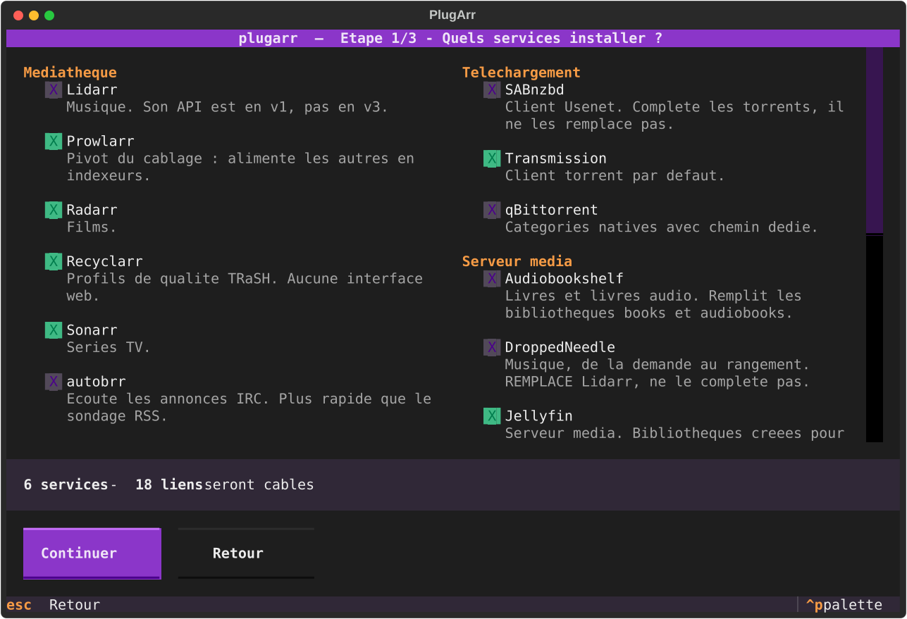
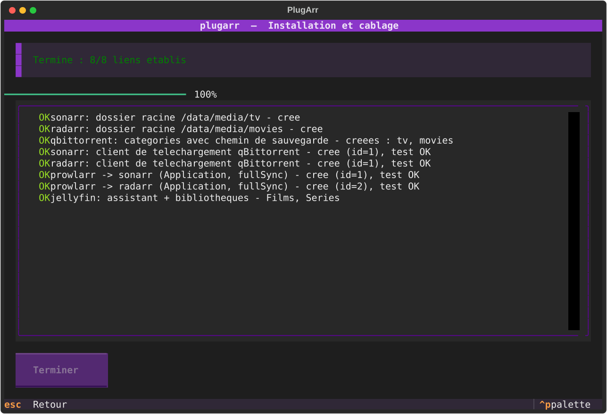
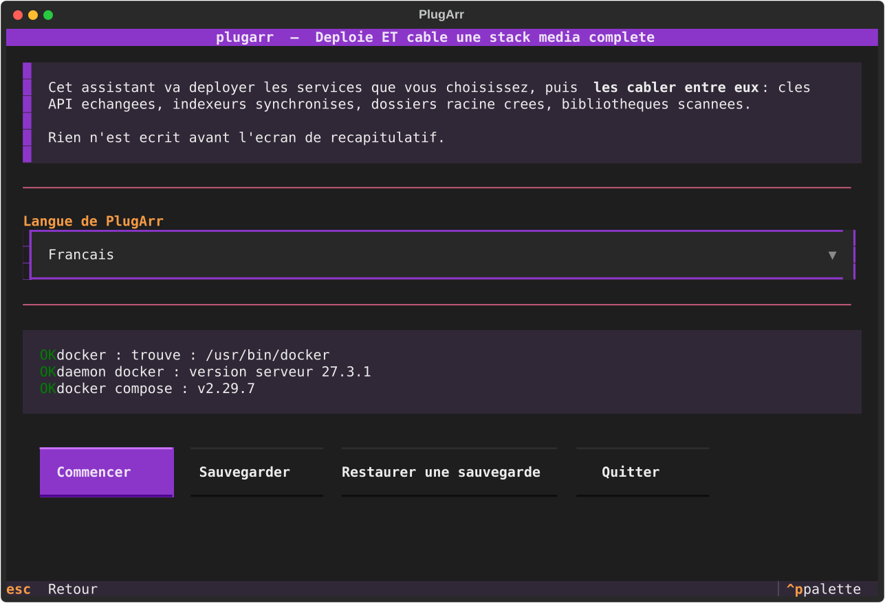
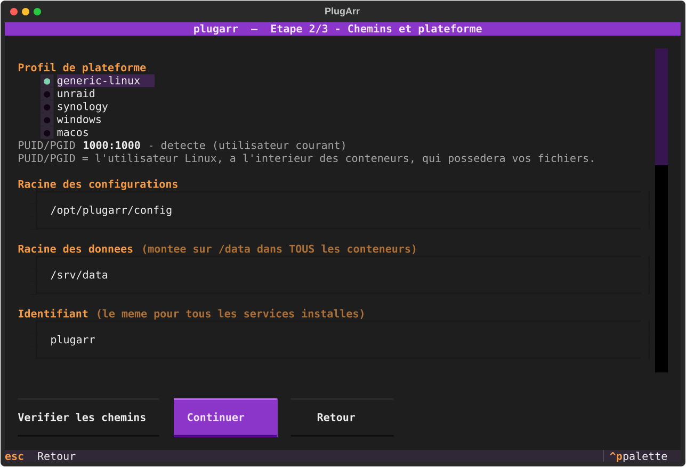
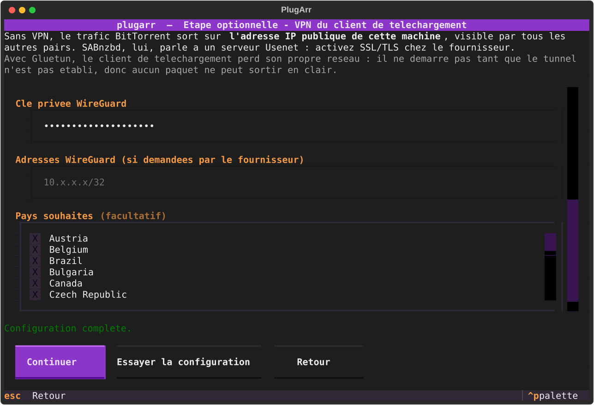
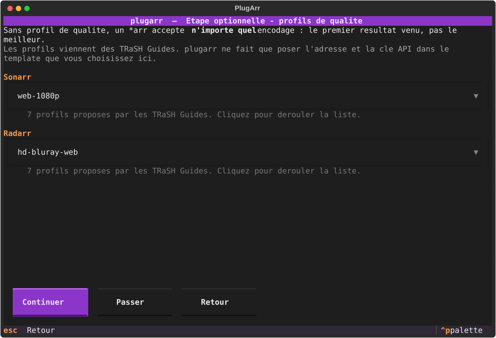
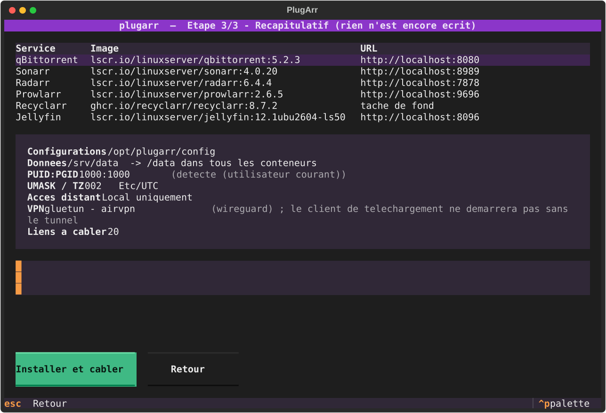
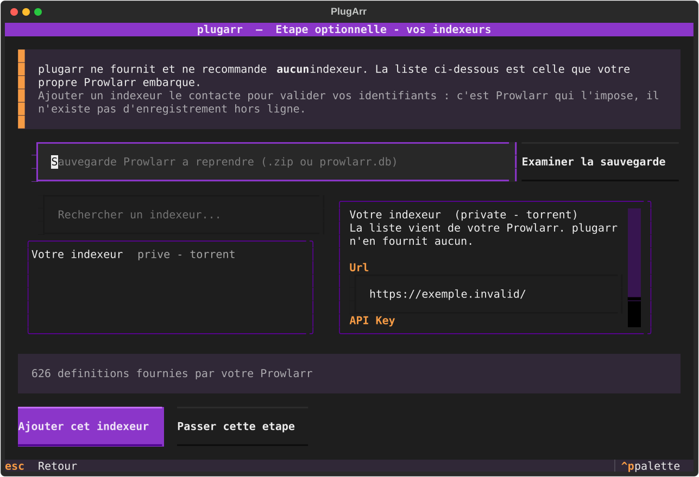
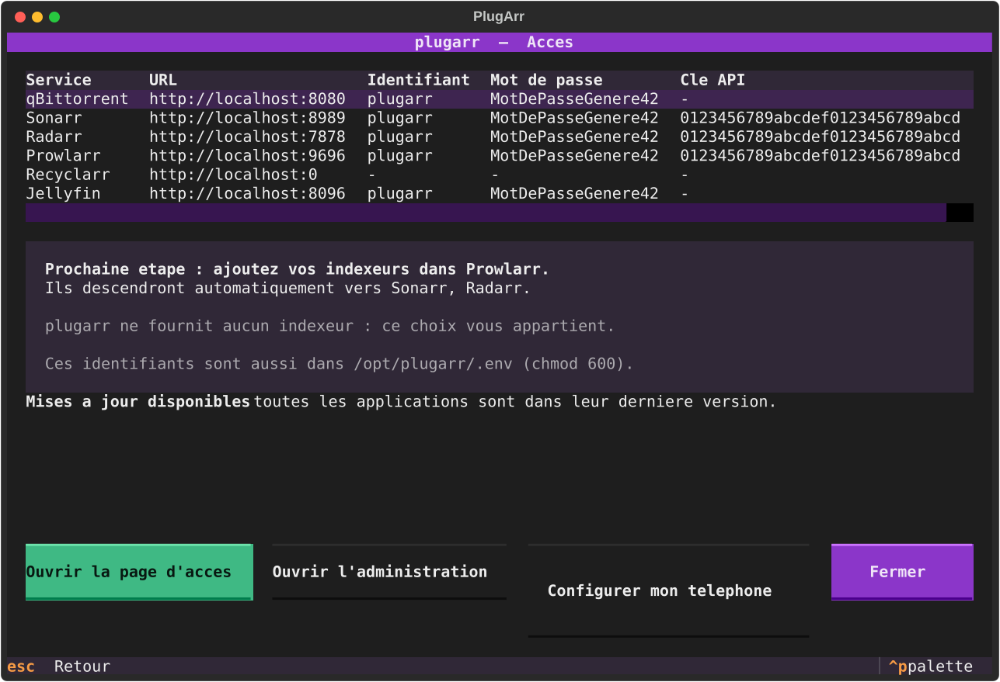

***Français** · [English](README.en.md)*

# PlugArr

**Déploie *et câble* une stack média complète. Une commande, zéro clic dans huit interfaces web.**

```bash
plugarr
```

**[plugarr-site.vercel.app](https://plugarr-site.vercel.app)** — le site du projet.

*En français ou en anglais, jusqu'aux messages d'erreur. PlugArr suit la langue
de votre système ; vos services ont la leur, choisie à part.*

<p align="center">
  
  
</p>

Vous cochez ce que vous voulez. À la fin, Prowlarr pousse déjà ses indexeurs vers Sonarr,
Radarr et Lidarr, les trois savent parler à votre client de téléchargement, leurs dossiers
racine existent, et Jellyfin a ses bibliothèques et se rafraîchit tout seul après chaque
import.

Pas d'assistant ? La même chose en une ligne, pour un script ou une CI :

```bash
plugarr install --yes --data-root /srv/data --config-root /opt/plugarr/config
```

---

## Le problème

Poser six conteneurs avec un `docker-compose.yml`, tout le monde sait faire.
Des dizaines de dépôts le font très bien.

Ce qui prend trois heures, c'est **l'après** : ouvrir chaque interface, copier une clé
API, la coller dans une autre, recommencer, se tromper de port, découvrir trois jours
plus tard que les imports recopient 40 Go au lieu de faire un lien.

PlugArr automatise cette partie-là.

| | Déploiement | Câblage inter-apps | Profils qualité | Langue de l'outil |
|---|---|---|---|---|
| DockSTARTer | oui | non | non | anglais |
| Saltbox | oui | partiel | non | anglais |
| Recyclarr / Configarr | non | non | oui | anglais |
| **PlugArr** | **oui** | **oui** | **oui** (via Recyclarr) | **français et anglais** |

La dernière colonne se vérifie, elle ne se suppose pas : aucun des trois ne
porte de fichier `.po`, de dossier `i18n`, ni la moindre occurrence de
`gettext`. Relevé le 5 septembre 2026, méthode dans
[docs/PRIOR-ART.md](docs/PRIOR-ART.md).

---

## Ce qui est câblé automatiquement

| Source | Cible | Ce qui est posé |
|---|---|---|
| Prowlarr | Sonarr, Radarr, Lidarr | enregistrement en *Application*, `fullSync` des indexeurs |
| autobrr | Sonarr, Radarr, Lidarr, client de téléchargement | déclarés dans autobrr, connexions testées |
| Prowlarr | client de téléchargement | rattachement + catégorie |
| Sonarr, Radarr, Lidarr | client de téléchargement | rattachement + routage par catégorie ou répertoire |
| Sonarr, Radarr, Lidarr | système de fichiers | dossier racine sous `/data/media` |
| qBittorrent | lui-même | catégories créées avec leur chemin de sauvegarde |
| Sonarr, Radarr | Jellyfin | notification de rafraîchissement après import |
| Jellyfin | système de fichiers | assistant de démarrage + bibliothèques Films, Séries, Musique |
| Silo | système de fichiers | compte, **profil**, bibliothèques Films, Séries, Musique en **lecture seule**, analyse lancée |
| Sonarr, Radarr, Lidarr, Prowlarr, Jellyfin, Silo | eux-mêmes | langue de leur interface, choisie une fois |
| Sonarr, Radarr, Lidarr, Prowlarr | interface web | compte créé, **connexion réellement testée** |
| Recyclarr | Sonarr, Radarr | profils de qualité et custom formats des TRaSH Guides, adresse et clé posées dans le template officiel, **première synchronisation lancée** |
| qui | qBittorrent | compte créé, instance déclarée, connexion confirmée par qui |
| Flood | qBittorrent | URL et identifiants passés au démarrage |

Les deux clients de téléchargement peuvent coexister : chaque *arr est rattaché aux
deux, et le routage s'adapte tout seul — qBittorrent a des catégories natives,
Transmission n'en a pas.

Chaque lien est **relu depuis l'API cible** après création. Le rapport final ne dit pas
« j'ai envoyé un POST », il dit « le lien existe ».

---

## Le piège que tout le monde rate : un seul montage `/data`

C'est l'erreur numéro un des stacks média. Monter `/downloads` et `/media` séparément
donne deux systèmes de fichiers *vus depuis le conteneur*. Les hardlinks deviennent
impossibles, et chaque import **recopie** le fichier au lieu de le lier.

PlugArr impose un montage unique dans tous les conteneurs :

```
${DATA_ROOT}/                    ->  /data   (dans TOUS les conteneurs)
├── torrents/
│   ├── movies/
│   ├── tv/
│   ├── music/
│   └── .incomplete/
└── media/
    ├── movies/                  <- dossier racine Radarr + bibliothèque Jellyfin
    ├── tv/                      <- dossier racine Sonarr + bibliothèque Jellyfin
    └── music/                   <- dossier racine Lidarr + bibliothèque Jellyfin
```

Le préflight ne se contente pas de l'espérer : il **crée un vrai hardlink** entre
`torrents/` et `media/` et vous dit si ça a marché.

---

## Deux langues, pas une

PlugArr existe en **français et en anglais**, et il ne faut pas confondre les
deux réglages :

| | Où | Ce que ça change |
|---|---|---|
| **Langue de PlugArr** | écran d'accueil, ou `--lang fr\|en` | l'assistant, la ligne de commande, le rapport, la page d'accès |
| **Langue des services** | écran des chemins, ou `--langue <code>` | ce que Sonarr, Radarr, Prowlarr, Jellyfin et Silo afficheront dans **leur** interface |

Sans rien régler, PlugArr suit la langue du système, et les services suivent
PlugArr. Rien n'oblige à les garder ensemble : on peut vouloir l'outil en
anglais et sa médiathèque en français.

Le choix est retenu dans `stack.yml` : `plugarr serve` et `plugarr doctor`
répondent ensuite dans la langue de l'installation, même sur un serveur dont la
session est en anglais.

**Y compris quand ça casse.** C'est la partie qu'on oublie : une phrase ajoutée
en français et absente du catalogue ne casse rien, elle s'affiche simplement en
français à quelqu'un qui a demandé l'anglais, sans erreur ni avertissement. Un
contrôle relève donc les **639 phrases** affichables — messages d'erreur,
avertissements de câblage, verdict du contrôle VPN, jusqu'aux en-têtes écrits
dans votre `.env` — et **échoue s'il en manque une**, ou si le catalogue porte
une entrée devenue morte :

```bash
python scripts/audit_traductions.py
```

Il tourne à chaque poussée.

---

## Installation

### Windows : un seul fichier, sans Python

Téléchargez `plugarr.exe` depuis la
[dernière version](https://github.com/yannickuhrig1/plugarr/releases), ouvrez un
terminal dans le dossier de téléchargement, et lancez :

```bash
.\plugarr.exe
```

Seul Docker Desktop est nécessaire. L'exécutable embarque son propre interpréteur : il
fonctionne sans Python installé, ce qui a été vérifié en le lançant avec un `PATH` vidé.
20 Mo, environ une seconde et demie au démarrage.

Windows SmartScreen peut afficher un avertissement au premier lancement : le binaire
n'est pas signé — une signature de code coûte plusieurs centaines d'euros par an.
« Informations complémentaires », puis « Exécuter quand même ».

### Les autres plateformes

Prérequis : Docker Engine (ou Docker Desktop) avec le plugin `docker compose`, et
Python 3.12 ou plus récent.

Quatre profils de plateforme : `windows`, `generic-linux`, `unraid`, `synology`.
Celui de la machine est présélectionné, avec les chemins qui vont avec.

```bash
pipx install git+https://github.com/yannickuhrig1/plugarr
```

Sans `pipx`, un environnement virtuel fait la même chose :

```bash
python -m venv ~/.venvs/plugarr && ~/.venvs/plugarr/bin/pip install git+https://github.com/yannickuhrig1/plugarr
```

Le paquet n'est pas encore sur PyPI : `pipx install plugarr` ne fonctionnera qu'après
la première publication.

Aperçu sans rien écrire :

```bash
plugarr install --dry-run
```

Sélection à la carte :

```bash
plugarr install --services prowlarr,sonarr,radarr,qbittorrent,jellyfin
```

Autres commandes :

```bash
plugarr             # assistant interactif
plugarr list        # catalogue des services
plugarr scan        # detecte une stack existante
plugarr adopt       # cable une stack existante sans la recreer
plugarr serve       # page d'administration : etat, demarrer / arreter
plugarr indexers    # chercher et ajouter vos indexeurs
plugarr upgrade     # aligne une installation ancienne sur cette version
plugarr wire        # rejoue le câblage sur une stack déjà démarrée
plugarr doctor      # diagnostique une installation existante
plugarr generate    # régénère docker-compose.yml depuis stack.yml
plugarr uninstall   # arrête la stack, ne touche jamais à vos médias
```

### Après l'installation : la page d'administration

<p align="center">
  <a href="docs/screenshots/10-administration.html"></a>
</p>

La page d'accès est un **fichier figé** : elle liste les adresses et les identifiants,
rien de plus. L'état des services, les boutons démarrer / arrêter / redémarrer et les
mises à jour disponibles viennent d'un petit serveur local.

Un fichier `administration.cmd` (`administration.sh` ailleurs) est déposé à côté des
artefacts : **double-cliquez dessus**. Il connaît le chemin de votre installation, donc
il fonctionne même sans `plugarr` dans le PATH.

L'accès se fait par un jeton tiré au hasard à chaque démarrage, affiché juste
au-dessus de l'URL. C'est suffisant tant que vous lancez la console à la main.
Si vous la laissez tourner, posez plutôt un mot de passe :

```bash
plugarr admin-password
```

Seule son empreinte rejoint `stack.yml` — PBKDF2, 600 000 itérations. Les
tentatives sont limitées, et une session expire au bout de douze heures.

Pour ne plus avoir à la lancer du tout :

```bash
plugarr autostart
```

La console démarre alors à chaque ouverture de session — **sur l'hôte, pas dans
un conteneur**. Ce n'est pas un détail de mise en œuvre : la console doit créer
et démarrer des conteneurs, et un conteneur qui en est capable peut monter la
racine de la machine et tourner en root. L'y enfermer reviendrait à exposer sur
le réseau un service aux pleins pouvoirs, sans rien gagner. Ici elle tourne sous
votre compte, écoute sur `127.0.0.1`, et reste hors du réseau Docker.

Windows dépose un script dans votre dossier Démarrage ; Linux installe une unité
systemd *utilisateur*. Aucun des deux ne demande les droits administrateur.
`plugarr autostart --disable` retire tout.

### En cas de problème

Chaque installation écrit un journal complet à côté de `docker-compose.yml` :

```bash
plugarr.log
```

Il contient la version, la plateforme, chaque étape, chaque avertissement et la trace
complète d'une erreur. **Aucun secret n'y figure** : les mots de passe et clés API sont
remplacés par leur nom avant écriture, pour qu'il puisse être joint à une issue sans y
réfléchir.

La version s'affiche aussi dans le bandeau de l'assistant, en pied de page d'accès, et
par `plugarr --version`.

Toutes les captures de ce README sont **générées automatiquement** par
`python scripts/screenshots.py`, sans terminal ni Docker, dans les deux langues.
Elles sont versionnées : une régression visuelle apparaît dans le diff d'une
pull request.

<details>
<summary>Les autres écrans de l'assistant</summary>

| | |
|---|---|
|  |  |
|  |  |
|  |  |
|  | |

</details>

---

## Mettre à jour une installation ancienne

Vous avez installé il y a six mois, vous téléchargez le binaire du jour. Une
commande :

```bash
plugarr upgrade
```

Elle fait quatre choses, dans cet ordre — et l'ordre compte : migrer
`stack.yml` si son schéma a changé, aligner les images sur le catalogue de
cette version, régénérer `docker-compose.yml` et `.env`, puis rejouer le
câblage. Le câblage passe en dernier parce qu'une étape ajoutée depuis peut
dépendre d'une image plus récente ; l'inverse, jamais.

**Elle ne redescend jamais une version.** Le tag déployé vit dans `stack.yml`
et non dans le code, précisément pour que vous puissiez mettre Sonarr à jour
sans attendre une version de PlugArr, ou rester délibérément sur une version
ancienne. `upgrade` ne propose donc que ce qui **avance**, et la comparaison se
fait sur des numéros, pas sur des chaînes : `4.9.5` vient avant `4.16.1`, ce
que l'ordre alphabétique inverse.

Ce qui est écarté est **affiché avec sa raison**, jamais sauté en silence :

```
ignore : radarr : 9.9.9 est deja plus recent que 6.3.0
ignore : prowlarr : maison et 2.5.2 ne se comparent pas
```

`--dry-run` montre le plan sans rien écrire, comme pour `install`.

### Réinstaller par-dessus une installation existante

`install` relancé au même endroit **reprend ce que la précédente portait** :
identifiant, VPN, profils de qualité, mot de passe de la console, et les
**identifiants de chaque service**.

Ce dernier point règle un vieux piège. qBittorrent, Jellyfin, autobrr et les
autres ne stockent leur mot de passe que **haché** : PlugArr ne peut pas le
relire, en générait un nouveau, l'annonçait, et le service le refusait. Mais
quand c'est PlugArr qui a installé, le mot de passe est dans **son** `stack.yml` :
il n'a jamais eu besoin de le relire ailleurs.

La reprise est **active par défaut** — perdre un VPN en silence est pire que
reprendre sans demander — mais jamais silencieuse. Le récapitulatif liste ce
qui a été repris, et un choix **Repartir de zéro** le refuse. Une option donnée
à la main prime toujours sur l'héritage.

```bash
plugarr install --repartir-de-zero   # ignorer l'installation précédente
```

Gluetun est couvert par là : tous ses réglages vivent dans `stack.yml`. Son
dossier `${CONFIG_ROOT}/gluetun` ne contient que `servers.json`, un cache qu'il
régénère — vérifié, il n'y a rien à y garder.

### `stack.yml` porte une version, et elle est enfin lue

Le champ `version` existait depuis la première ligne du projet et **rien ne le
lisait**. Il protège pourtant d'une perte de données mesurable : pydantic
ignore les champs qu'il ne connaît pas, donc une version ancienne lisant un
`stack.yml` récent en jetait une partie — et la **première écriture la
détruisait**, `install`, `generate` et la rotation d'un mot de passe réécrivant
tous ce fichier.

Le cas arrive dès qu'on revient en arrière : on essaie une nouvelle version,
quelque chose déplaît, on relance l'ancien binaire.

PlugArr refuse maintenant de lire un `stack.yml` plus récent que lui :

```
stack.yml est en version 2, cette version de PlugArr lit jusqu'a la 1.
Mettez PlugArr a jour : continuer effacerait les reglages qu'il ne sait pas lire.
```

---

## Vous avez déjà une stack ?

`install` s'adresse à qui part de zéro. Si vos services tournent déjà, montés à la main
au fil des années, PlugArr peut **les câbler sans rien recréer** :

```bash
plugarr scan     # ce qui est détecté sur cette machine, sans rien écrire
plugarr adopt --data-root /mnt/user/medias --config-root /mnt/user/appdata
```

Il lit les clés API dans les `config.xml` de vos conteneurs, puis pose les mêmes liens
que `install`. **Aucun conteneur n'est démarré, arrêté ou recréé**, et aucun
`docker-compose.yml` n'est généré : ces services ne lui appartiennent pas.

Trois principes, appris en le testant sur une vraie stack :

- **Votre arborescence est la vôtre.** Les dossiers racine existants sont lus et
  respectés, jamais remplacés. Idem pour les catégories de votre client.
- **Deux Sonarr ? PlugArr ne devine pas.** Il s'arrête et demande
  `--pick sonarr=<conteneur>`. Un choix silencieux serait pire qu'une question.
- **Un nom de conteneur ne prouve rien.** PlugArr reconnaît ses propres services à un
  libellé qu'il pose, pas à leur nom : `mon-sonarr` est à vous, il n'y touche pas.

---

## La page d'accès

À la fin de l'installation, PlugArr génère une page HTML locale et l'ouvre dans votre
navigateur. Plus besoin de retrouver quel service écoute sur quel port : une carte par
service, les dossiers de téléchargement et de médiathèque, les identifiants.

Trois détails qui comptent :

- **Les mots de passe et clés API sont masqués** jusqu'à un clic. La page reste un
  fichier local en `chmod 600`, exclu du dépôt — mais on la montre parfois à quelqu'un,
  et elle ne doit pas afficher votre clé Sonarr d'entrée.
- **Les liens n'utilisent pas `localhost`.** Installée sur un NAS, une URL en localhost
  pointerait vers la machine qui consulte. PlugArr détecte l'adresse de la machine
  sur le réseau local et génère les liens avec.
- **Les raccourcis vers les dossiers sont donnés en chemin copiable *et* en lien.**
  Un lien `file://` ne fonctionne que si le navigateur tourne sur la machine
  d'installation ; c'est écrit sur la page plutôt que découvert par un lien mort.

`--no-open` génère la page sans ouvrir le navigateur.

### Piloter les services

```bash
plugarr serve
```

La même page, mais **servie** : état de chaque service en direct, et des boutons pour
démarrer, arrêter ou redémarrer. Le fichier statique ne peut pas faire ça — un HTML
n'exécute rien, il faut un serveur.

Une page capable d'arrêter vos conteneurs mérite d'être prise au sérieux :

- **écoute sur `127.0.0.1`** par défaut ; `--host` pour l'exposer, avec un avertissement ;
- **un jeton aléatoire par démarrage**, jamais écrit sur disque, transmis par l'URL puis
  gardé en cookie `HttpOnly` ; comparaison à temps constant ;
- **listes fermées** : le nom de service est validé contre votre configuration et
  l'action contre trois valeurs, avant d'atteindre une ligne de commande.

### Mises à jour

La page signale les mises à jour disponibles et les applique en un clic. Deux choses
distinctes, présentées séparément parce qu'elles n'ont pas les mêmes conséquences :

- **une version plus récente existe** — le tag déployé change, `stack.yml` est réécrit ;
- **l'image a été reconstruite** — même version, contenu republié en amont. LinuxServer
  le fait très souvent, pour les correctifs de sécurité de l'image de base.

Le tag déployé vit dans `stack.yml`, pas dans le code de PlugArr : vous pouvez donc
mettre Sonarr à jour sans attendre une nouvelle version de l'outil, ou rester
délibérément sur une version ancienne.

Une seule mise à jour à la fois, avec confirmation, et `--no-deps` : mettre Sonarr à jour
ne redémarre pas votre client de téléchargement au passage. Si le téléchargement échoue,
le tag est remis comme il était.

---

## Comment ça marche

**Les clés API sont pré-semées, pas devinées.** Plutôt que de démarrer les conteneurs
puis de courir après une clé générée aléatoirement, PlugArr écrit lui-même le
`config.xml` avant le premier démarrage. Le câblage devient déterministe et rejouable.

**Les payloads viennent des schémas.** Aucun JSON de client de téléchargement n'est codé
en dur. PlugArr demande son gabarit à l'application (`/api/v3/downloadclient/schema`),
remplit les champs par nom, et renvoie l'objet. Quand une nouvelle version renomme un
champ, le gabarit suit. Les champs qu'une version n'expose pas sont **signalés**, jamais
perdus en silence.

**Tout est idempotent.** Relancer `install` sur une stack existante ne crée pas de
doublon et n'écrase aucun réglage manuel. Un `config.xml` déjà présent fait autorité :
PlugArr adopte sa clé plutôt que d'imposer la sienne.

**`stack.yml` est la source de vérité.** `docker-compose.yml` et `.env` en sont des
artefacts générés, versionnables et diffables. Ne les éditez pas à la main.

---

## Sécurité

Les interfaces web sont protégées par un **login** (`Forms` + `Enabled`), avec un mot de
passe généré par installation. L'API reste joignable par clé, ce qui permet le câblage
automatique sans laisser Sonarr et Radarr ouverts à tout le réseau local.

Les identifiants sont écrits dans `.env` en `chmod 600`, déjà couvert par le
`.gitignore` généré, et masqués dans les journaux.

L'identifiant est **le vôtre** : PlugArr n'est qu'un défaut, changeable dans
l'assistant ou par `--username`. Le même pour tous les services, ce qui garde la page
d'accès lisible.

**Chaque installation génère ses propres secrets**, tirés par `secrets`, la source
cryptographique de Python. Rien n'est réutilisé d'une machine à l'autre, et aucun mot de
passe par défaut n'existe.

| | Composition | Longueur |
|---|---|---|
| Mots de passe | minuscules, majuscules, chiffres et `!@%^*-_=+.,:?` — **au moins un de chaque** | 20 |
| Clés API | hexadécimal, format imposé par les *arr | 32 |

75 caractères possibles sur 20 positions, soit environ **125 bits** d'entropie.

L'alphabet des caractères spéciaux est court **volontairement** : ces valeurs traversent
un `.env` lu par Docker Compose, une ligne de commande de conteneur, un XML, un INI et
plusieurs charges JSON. `$` en est exclu — Compose l'interprète comme une interpolation
de variable, et un mot de passe contenant `$HOME` arriverait déformé dans le conteneur.
Sont aussi exclus l'apostrophe, le guillemet, l'antislash, le backtick, `#` et tout
métacaractère de shell. Les valeurs du `.env` sont en outre écrites entre apostrophes.

**Sans VPN**, le trafic BitTorrent sort sur votre IP publique. PlugArr vous
l'affiche au récapitulatif.

L'assistant pose la question juste après les chemins, dès qu'un client de
téléchargement est coché. En ligne de commande, c'est `--vpn` : dans les deux
cas le client passe par [Gluetun](https://github.com/passteque/gluetun).

```bash
plugarr install --vpn --vpn-provider nordvpn --vpn-key <votre-cle-wireguard>
```

```bash
plugarr vpn-providers   # les 25 fournisseurs acceptes
```

L'assistant propose ensuite les **serveurs que Gluetun connaît pour ce
fournisseur**, en liste cliquable, plutôt qu'un champ libre où une valeur
inventée ferait échouer le démarrage. Attention, tous ne se filtrent pas par
pays : Windscribe, VyprVPN, Giganews et Private Internet Access classent leurs
serveurs par **région**, Perfect Privacy par **ville**. PlugArr pose donc
`SERVER_COUNTRIES`, `SERVER_REGIONS` ou `SERVER_CITIES` selon le cas. Les listes
sont extraites de l'image **épinglée** par `python scripts/vpn_countries.py`.

### Le port entrant

Sans port entrant, le client télécharge très bien mais ne partage qu'à moitié :
seuls les pairs qui acceptent vos connexions sortantes sont joignables. Ce n'est
**pas** une question de protection — les vingt et un autres fournisseurs
chiffrent exactement pareil — mais de ratio, et rien ne le signalait.

Quatre fournisseurs sur vingt-cinq le permettent. PlugArr l'active alors sans
rien demander : c'est un gain sans contrepartie, et le contrôle dira si le port
est réellement arrivé plutôt que de le supposer.

| Fournisseur | Lieux qui l'offrent | Filtre posé |
|---|---|---|
| ProtonVPN | 125 pays sur 127 | `SERVER_COUNTRIES` |
| Private Internet Access | 110 régions sur 165 | `SERVER_REGIONS` |
| PrivateVPN | 56 pays sur 56 | `SERVER_COUNTRIES` |
| Perfect Privacy | 38 villes sur 38 | `SERVER_CITIES` |

Trois conséquences, chacune capable de tout casser en silence.

**L'assistant ne propose que les lieux qui en offrent un.** Ce n'est pas du
confort d'affichage : `VPN_PORT_FORWARDING=on` restreint la sélection de Gluetun,
qui refuse alors de **démarrer** s'il ne trouve aucun serveur. Chez Private
Internet Access, les 55 régions écartées sont les 55 régions des États-Unis : un
utilisateur américain qui choisit son propre pays obtiendrait une pile morte,
sans qu'aucun message ne l'explique.

**Le port change tout seul, et le client ne le suit pas.** Constaté sur une
stack réelle : Proton a changé de port entre deux journées, Gluetun annonçait
48406, qBittorrent écoutait toujours 45270. Plus aucune connexion entrante, et
rien nulle part ne le disait. PlugArr dépose donc un script dans
`${CONFIG_ROOT}/gluetun`, que Gluetun lance à chaque attribution ; il pose le
nouveau port chez qBittorrent ou Transmission depuis l'intérieur du tunnel.

**Le contrôle relit le port chez le client, et le repose s'il a glissé.** Même
exigence que pour le câblage : on ne dit pas « j'ai posé le port », on relit la
valeur et on la compare. Le verdict est **séparé** de celui de la protection,
parce qu'un port désynchronisé coûte du partage et non de l'exposition — et il
n'est jamais bloquant. `plugarr doctor` ne se contente plus de le signaler : il
rejoue le script que Gluetun lance lui-même, puis **relit** avant de conclure.
C'est ce qui rattrape le seul angle mort d'un mécanisme événementiel — un client
recréé entre deux attributions de port ne reçoit aucun appel.

Chez ProtonVPN en OpenVPN, le port dépend du suffixe de l'identifiant. Sur le
compte d'essai il est arrivé **avec et sans** `+pmp`, donc PlugArr ne touche pas
à ce que vous tapez ; si le contrôle signale qu'aucun port n'est obtenu, il vous
propose d'ajouter `+pmp` à la fin du vôtre.

### Essayer avant d'installer

L'assistant ne vérifiait que la *présence* des champs : une clé fausse passait
l'écran sans un mot, et vous découvriez trois écrans plus tard un client
injoignable, sans lien évident avec ce que vous aviez tapé. Le bouton
**« Essayer la configuration »** monte un Gluetun jetable avec exactement ce qui
a été saisi, attend qu'il sorte, et lui demande **par où**. Une adresse publique
vide vaut échec : avec une clé bien formée mais invalide, WireGuard « s'établit »
sans qu'aucun paquet ne passe. Le conteneur est supprimé dans tous les cas.

C'est un avertissement, **jamais un blocage** : un essai peut échouer parce qu'un
serveur du fournisseur est en carafe, et refuser d'installer là-dessus serait
disproportionné. Trois refus sont pourtant certains, et nommés comme tels : aucun
serveur ne correspond au lieu demandé, une clé WireGuard illisible, des
identifiants OpenVPN rejetés.

En **OpenVPN**, comptez plus long. Le protocole patiente soixante secondes fermes
sur un serveur muet avant d'en changer, là où WireGuard le constate en quelques
secondes — l'essai lui accorde donc deux minutes au lieu de quarante-cinq
secondes. Une configuration valide répond toujours en une quinzaine de secondes.

Ce qui compte n'est pas que le tunnel existe, c'est qu'**aucun paquet ne puisse sortir
sans lui**. Le client de téléchargement ne démarre pas tant que Gluetun n'est pas
*healthy* — vérifié avec des identifiants volontairement faux : Gluetun reste
`unhealthy`, et qBittorrent ne quitte jamais l'état `created`.

Deux subtilités traitées, chacune capable de tout casser en silence : les ports du
client **migrent vers Gluetun** (un conteneur qui partage une pile réseau ne peut plus
publier de port), et le câblage vise `http://gluetun:8080` car le client **perd son
alias DNS**.

---

## Vos indexeurs

Une fois la stack en place, l'assistant propose une **étape optionnelle** pour saisir
les indexeurs que vous utilisez déjà. Elle se passe d'un bouton.

La liste proposée n'est pas la nôtre : ce sont les **626 définitions que votre propre
Prowlarr embarque**. PlugArr n'est qu'un formulaire par-dessus, et n'en présélectionne
aucune. Il devine quels champs sont des identifiants (clé API, passkey, cookie, mot de
passe) et n'affiche que ceux-là, plutôt que de vous noyer sous la douzaine d'options de
réglage que chaque définition traîne.

En ligne de commande, la même chose reste scriptable :

```bash
plugarr indexers search <terme>          # chercher dans les définitions de VOTRE Prowlarr
plugarr indexers add "<nom>" -f apiKey=… # ajouter avec VOS identifiants
plugarr indexers list                    # ce qui est déjà configuré
```

Un point à connaître : **ajouter un indexeur le contacte** pour valider vos identifiants.
C'est Prowlarr qui l'impose — `forceSave` n'y change rien, il n'existe pas
d'enregistrement hors ligne. La contrepartie est agréable : si l'ajout réussit, vos
identifiants sont bons.

---

## Profils de qualité

Sans profil de qualité, un *arr accepte **n'importe quel encodage** : le premier résultat
venu, pas le meilleur. C'est le travail des [TRaSH Guides](https://trash-guides.info/),
et PlugArr ne les réimplémente pas — il installe **Recyclarr**, lui demande de générer
sa configuration à partir d'un template officiel, et n'y écrit que les deux lignes qu'il
est seul à connaître : l'adresse et la clé API.

Recyclarr est coché par défaut. Il ne publie aucun port, n'a pas d'interface web, et se
réveille une fois par jour.

L'assistant propose une **étape optionnelle** pour choisir le template, service par
service. La liste vient du manifeste officiel, pas d'une copie embarquée ici : 22 pour
Sonarr, 35 pour Radarr, dont plusieurs profils français.

```bash
plugarr templates                                            # les noms acceptés
plugarr install --recyclarr-radarr french-multi-vf-hd-bluray-web
```

Un nom inconnu est refusé **avant** que quoi que ce soit ne soit écrit. Sans cette
vérification, l'erreur n'apparaîtrait qu'à la toute fin du câblage, la stack déjà
démarrée.

Résultat mesuré sur une installation neuve, lu dans l'API de chaque instance :

| | Sonarr `web-1080p` | Radarr `hd-bluray-web` |
|---|---|---|
| Custom formats | 37 | 40 |
| Profil créé | `WEB-1080p` | `HD Bluray + WEB` |

---

## Ce que ce projet ne fait pas

PlugArr ne fournit, n'héberge et ne recommande **aucun indexeur, aucun tracker, aucun
contenu**, et n'en préconfigure aucun. Aucune liste n'est livrée avec le code : celle de
l'assistant vient de Prowlarr. C'est un outil d'automatisation de médiathèque personnelle.
Ce que vous y branchez, et sa légalité, vous regardent.
Voir [DISCLAIMER.md](DISCLAIMER.md).

---

## Périmètre actuel

Prowlarr · Sonarr · Radarr · **Lidarr** · Transmission · **qBittorrent** · **SABnzbd**
· Jellyfin · **Seerr** · **Audiobookshelf** · **DroppedNeedle** · **Silo** *(expérimental)*
· autobrr · Recyclarr · Gluetun *(VPN optionnel)* · Flood et qui *(UI optionnelles)*

Versions testées : voir [docs/COMPATIBILITY.md](docs/COMPATIBILITY.md).

**Deux piles sur une machine.** Docker identifie une pile par son *nom*, jamais
par son répertoire : deux installations qui partagent le nom `plugarr`
partagent leurs conteneurs, et la seconde recrée ceux de la première. Passez
`--project-name` (ou remplissez le champ correspondant dans l'assistant) pour en
installer une seconde à côté. Le préflight avertit si le cas se présente.

### Feuille de route

Le détail vit dans [ROADMAP.md](ROADMAP.md), tenue à jour : ce qui marche, ce
qui est en cours, ce qu'on ne fera pas et pourquoi. Résumé ci-dessous.

**La console PlugArr est disponible.** Lancez `plugarr serve` sur l’hôte pour
consulter les états, démarrer ou arrêter les services, appliquer leurs mises à
jour, faire un diagnostic, sauvegarder, ajouter des services et renouveler les
identifiants. Elle utilise un jeton ou un mot de passe pour l’authentification.

La branche locale ajoute une carte des liaisons *arr, des tests et réparations
ciblés, une maintenance planifiée, un historique, des alertes dans la console
et la mise à jour automatique de l’exécutable Windows. Ces changements ne
constituent pas une release publiée. Voir [LOCAL_TESTING.md](LOCAL_TESTING.md).

Côté services, dans l'ordre où ils seront étudiés :

| | Ce qu'il reste à faire |
|---|---|
| **Plex** | Second serveur média, à côté de Jellyfin. Son jeton s'obtient par `plex.tv`, pas par l'API locale : c'est le point à vérifier avant de l'inscrire. |
| **Notifiarr** | Notifications centralisées pour toute la stack. Chaque *arr s'y déclare par une clé API. |
| **Bazarr** | Sous-titres. Étudié, mais sa configuration passe par un fichier YAML et non par une API — rien n'est encore vérifié. |
| **Wizarr** | Invitations et gestion des comptes pour Jellyfin, Plex et Emby. Le service le plus autonome de cette liste : un conteneur, et le câblage se réduit au serveur média et à sa clé. |
| **Tautulli** | Suivi et statistiques **Plex**. Ne peut donc pas précéder Plex, qui figure déjà plus haut : sans jeton Plex, il n'a rien à observer. |
| **Jellystat** | Statistiques Jellyfin. Obstacle connu : le service exige une base **PostgreSQL** dans un second conteneur, là où tout le catalogue actuel tient en un seul. `JS_USER` / `JS_PASSWORD` laissent en revanche espérer un pré-semis des identifiants. |
| **Tracearr** | Suivi des lectures et détection de partage de comptes, pour Plex, Jellyfin et Emby. L'image `latest` réclame une base et un Redis externes ; le tag `supervised` réunit le tout en un conteneur — c'est celui à vérifier. |
| **Shelfmark**, **Shelfarr** | Livres et livres audio, à côté d'Audiobookshelf déjà au catalogue. |

Un service n'entre au catalogue que lorsqu'il est **câblé et vérifié** contre une
instance réelle. Voir [PROMPT.md](PROMPT.md) pour le détail.

**Readarr n'est pas au programme** : le projet est archivé depuis le 27 juin 2025.

---

## Contribuer

Une règle avant tout : **ne devinez aucun endpoint, aucun tag d'image, aucun port.**
Vérifiez contre la doc officielle ou contre une instance réelle. Quand ce n'est pas
vérifiable, marquez `TODO(verify)` plutôt que d'écrire du code plausible mais faux.
La fiabilité du câblage est la seule raison d'être de ce projet.

Pendant la seule phase 1, cinq hypothèses parfaitement raisonnables se sont révélées
fausses au premier contact avec un vrai conteneur. Elles sont toutes consignées, avec
leurs codes HTTP, dans [docs/COMPATIBILITY.md](docs/COMPATIBILITY.md) — c'est le
document le plus utile du dépôt.

Le reste est dans [CONTRIBUTING.md](CONTRIBUTING.md) : mise en place, découpage du code,
comment ajouter un service. Et [docs/PRIOR-ART.md](docs/PRIOR-ART.md) explique où
PlugArr se situe par rapport à DockSTARTer, Saltbox et Recyclarr, et pourquoi il ne
cherche pas à les remplacer.

## Remerciements

[TRaSH Guides](https://trash-guides.info/), [Servarr](https://wiki.servarr.com/) et
[LinuxServer.io](https://www.linuxserver.io/), sans qui rien de tout ceci n'existerait.

## Licence

MIT
